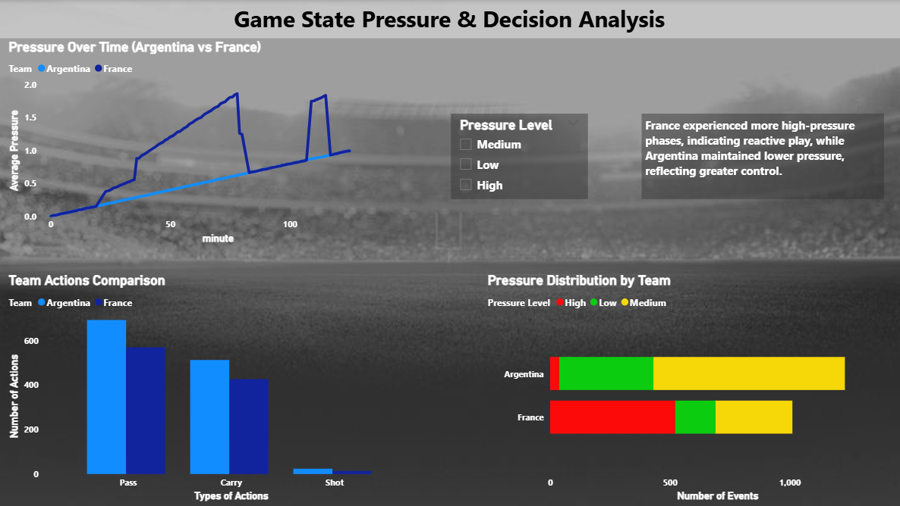

# 📊 Game State Pressure & Decision Analysis

## 🚀 Overview
This project analyzes how **pressure evolves during a football match** and how it influences **team decision-making**. Instead of relying on basic statistics, a **custom pressure model** was developed using game context such as score difference and match time.

---

## 🎯 Problem Statement
Traditional football analysis focuses on isolated metrics like passes, shots, and possession. However, it often ignores the **context in which these actions occur**.

This project aims to:
- Quantify **game pressure dynamically**
- Understand how teams behave under different pressure conditions
- Provide deeper insights into **decision-making patterns**

---

## 🧠 Approach

### 🔹 Data Processing
- Cleaned and structured event-level match data
- Extracted key features:
  - Match time (normalized)
  - Score difference

---

### 🔹 Pressure Model

Pressure is calculated using:

events['pressure_arg'] = (1 + (-events['arg_score_diff']).clip(lower=0)) * events['time_norm']

events['pressure_fra'] = (1 + (-events['fra_score_diff']).clip(lower=0)) * events['time_norm']

Additional logic:
- Higher pressure when a team is **losing**
- Moderate pressure during **draw situations**
- Pressure increases as the match progresses

---

### 🔹 Pressure Classification
Pressure values are categorized into:
- Low
- Medium
- High

---

### 🔹 Analysis Performed
- Pressure variation over time
- Team actions (Pass, Carry, Shot)
- Distribution of pressure levels across teams
- Behavioral differences under pressure

---

## 📊 Key Insights
- France experienced more **high-pressure phases**, indicating reactive gameplay  
- Argentina maintained **lower and more stable pressure**, reflecting better control  
- Teams showed different action patterns depending on pressure levels  

---

## 📈 Dashboard
The analysis is visualized using Power BI:
- Pressure trends over time  
- Team action comparison  
- Pressure distribution across teams  

📷 Preview:

---

## 🛠️ Tech Stack
- Python (Pandas, NumPy)
- Jupyter Notebook
- Power BI
- Data Visualization

---

## ⚙️ How to Run

1. Open the Jupyter Notebook:
   notebooks/pressure_analysis.ipynb  

2. Run all cells to generate pressure metrics  

3. Open Power BI file:
   dashboard/powerbi_dashboard.pbix  

---

## 🔥 Key Features
- Custom **game-state pressure model**
- Context-aware football analysis
- Time-based pressure tracking
- Decision behavior insights under pressure

---

## 📌 Future Improvements
- Add player-level analysis  
- Include expected goals (xG) for deeper insights  
- Extend model for predictive analysis  

---

## 🙌 Acknowledgment
This project was developed to explore how **data can capture decision-making under pressure in sports analytics**.

---

## ⭐ If you found this interesting, feel free to star the repo!
